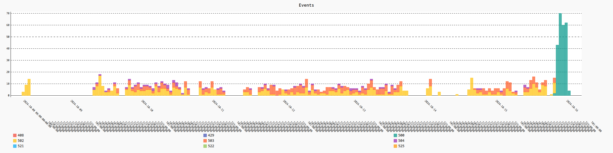

# KSP's Forum Preservation Project :: News :: 2024-1016

## Forum is down!!

As we can see from the chart below, Forum gone titties up somewhere between 2024-1015T15:00z and 2024-1016T01:00z :

Reason is unknown, but some educated guesses were made on Reddit. For two months already, it was detected that IA scrapers were hammering Forum mercilessly. I can't affirm that by myself, but this is the information that was given to us on Forum.

Forum's admins didn't sit on their hands, but for every measure Forum applied, whoever were hammering Forum counter-measure it somehow.

IMHO someone on Forum said "enough" and pulled the Database's plug. I hope that this measure would be temporary, and that they plan to replug the DB once the IA Scraping session is over.

Interesting enough, I received my daily "Your Kerbal Space Program Forums digest" email at `Wed, 16 Oct 2024 14:59:58 +0000`, essentially 15 to 16 hours since my last successful `http 200 ok` from them.

So the DB is not dead, apparently it was disconnected only from the Front End.

Well, it's good news - besides being somewhat bittersweet. This is what I think it happened:

1. TTWO downgraded their infrastructure to save some bucks, since they got a huge loss reported on the Q2 2024 Quaterly Earnings Report (IIRC - I think it was on May). We are talking about 3.6B USD of losses. Billions!!
1. Some months later (late July or early Aug if memory serves me well), Forum started to get a awful ammount of 5xx errors. From 500 to 525, you name it.
1. On Forum someone explained that it was AI Companies scraping season again, as lots and lots of websites were complaining about being hammered.
1. Forum's admins started to counter measure the hammering - I witnessed that, becausing I'm monitoring the Forum since then.
1. For every measure the Admins took, after 12 to 36 hours later (tops) the hammering was back.
1. I remember posting on that thread (last week, I think - Friday, I guess?) that since there's nothing that the admins could do that would not be counter-measured by whoever was hammering Forum, the less worst one can do is to just shut the thing down and wait for hammering to stop, saving the money. If the Forum would be unusable for the legit users, why paying bandwidth so the AI Companies could make a fortune at their expenses?
1. A couple hours ago, I received my daily "Your Kerbal Space Program Forums digest" email. So it's a evidence that the Forum's services and database are alive and well.

So, it appears to be an intentional denial of service from someone at the backend. If Forum had just shutdown (intentionally or by some backend failure) I would not had received the digest email from them at my lunch time later. 

On a way or another, Vanamonde [reached us on reddit](https://www.reddit.com/r/KerbalSpaceProgram/comments/1g4j9rn/comment/ls8ex0o/), telling they managed to contact the tech guys responsible for Forum and they were informed and are working on it.

## References

* [Reddit Comment](https://www.reddit.com/r/KerbalSpaceProgram/comments/1g4j9rn/comment/ls7bxz3/?utm_source=share&utm_medium=web3x&utm_name=web3xcss&utm_term=1&utm_content=share_button)
* [Reddit Comment](https://www.reddit.com/r/KerbalSpaceProgram/comments/1g4j9rn/comment/ls7p4bg/?utm_source=share&utm_medium=web3x&utm_name=web3xcss&utm_term=1&utm_content=share_button)
* [Reddit Comment](https://www.reddit.com/r/KerbalSpaceProgram/comments/1g51izh/comment/ls8c5jr/?utm_source=share&utm_medium=web3x&utm_name=web3xcss&utm_term=1&utm_content=share_button)
