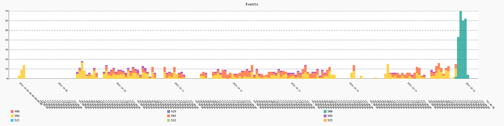

# KSP's Forum Preservation Project :: News :: 2024-1020

## Some people's kids...

It came to my attention that I was being personally blamed on Discord for the Forum's outage. Oh, *krap*, here we go again - the slandering campaign never ceases, as it appears...

I also fail to understand why some people would try to **defend** the AI Bots - if I, a simple dude, could bring Forum down, why in hell the AI Bots would do less?

Anyway, someone asked me on Reddit about evidences, so evidences I gave them: the first time someone touched the subject (that I had notice) was on Forum, on the thread [bad-gatewaypossible-endtheoriessolutions](https://web.archive.org/web/20240919134316/https://forum.kerbalspaceprogram.com/topic/225145-bad-gatewaypossible-endtheoriessolutions/) that, unfortunately, is archived only up to September. There was another thread there where some linked to a Post somewhere else where a dude was complaining about a IP hammering his site mercilessly, and that he tracked the IP to a AI Company. I wish I would had registered them on my repo, but whatever.

It was speculated that at least one of these scrappers doesn't knows how to handle Invision Forums (and similar software), entering in an infinite loop over the same set of pages (a problem that I had detected myself, but fixed in less than a week).

I managed to remember the following ones, however

* https://www.reddit.com/r/technology/comments/1dlyh33/ai_companies_are_reportedly_still_scraping/
* https://www.npr.org/2024/07/05/nx-s1-5026932/artificial-intelligence-web-crawlers-are-running-amok
* https://news.ycombinator.com/item?id=35701565
* I remember some other moderator (IIRC Gargamel, but don't trust this information without further evidence) complaining about - I wish I could remember when, as doing searches on Web Archive is virtually impossible.

I found these on Google, between others, but these links where darkened meaning that I had visited them before.

Now, and foresseing where you could possibly be going (because **I was** accused of being part of the problem due [this](https://github.com/net-lisias-ksp/KSP-Forum-Preservation-Project)), follows my evidences that Personal Scrappers **weren't** the main problem:

* The 5xx http errors were already happening **way** before [this thread](https://web.archive.org/web/20240926115726/https://forum.kerbalspaceprogram.com/topic/225365-an-update-of-sorts-from-your-forum-moderation-team/) was created, prompting some people (me betweent them) to start projects to preserve the Forum Content.
* I was being able to scrap only 10 to 11 pages per minute **tops** in the last months (being the reason my archive wasn't completed yet), and yet Forum was still borking on 5xx errors.

The only way scrappers would have been able to put Forum into its knee would be:

* by exploring some loophole on CloudFlare (and I guarantee you that without some kind of loophole, CloudFlare would render your IP useless on every  CloudFlare client). And CloudFlare was set to impose some [pretty draconian limits](https://blog.cloudflare.com/declaring-your-aindependence-block-ai-bots-scrapers-and-crawlers-with-a-single-click/), I can guarantee you myself.
* by knowing and accessing directly the Forum's server IP - that should be, so, utterly misconfigured as this machine is expected to ignore any request not coming from a CloaudFlare network.
* by hiring hundreds (if not thousands) of bots to do the scrapping coordinately, each one obeying the current CloudFlare restrictions.
* by [**paying** CloudFlare and TTWO](https://techcrunch.com/2024/09/23/cloudflares-new-marketplace-will-let-websites-charge-ai-bots-for-scraping/) for an authorisation to do so. There're provisions on CloudFlare configuration for such.

Any of them imposing a tax **way** above what any individual or small group of enthusiasts could manage.

However, and this is a very serious possibility... The current outage is different, as one can see for this report:

This suggests that somewhere about 2024-1015T12:00z at least (my last successful `HTTP 200 Ok` is from 2024-10-16T01:03:29z - perhaps due some caching?), something on the **database** itself got broke, because the Forum's Front Page was being loaded alright, only the link that would hit the MySQL server got the `500` salute.

Forum outages were used to last a few hours, but this one is lasting **for days**. So, now, I have evidences that we are handling something different.

I had talked about here: https://www.reddit.com/r/KerbalSpaceProgram/comments/1g70ajs/comment/lso0p36/?utm_source=share&utm_medium=web3x&utm_name=web3xcss&utm_term=1&utm_content=share_button

## References

* [Reddit commment](https://www.reddit.com/r/KerbalSpaceProgram/comments/1g87r8v/comment/lswj9va/?utm_source=share&utm_medium=web3x&utm_name=web3xcss&utm_term=1&utm_content=share_button)
