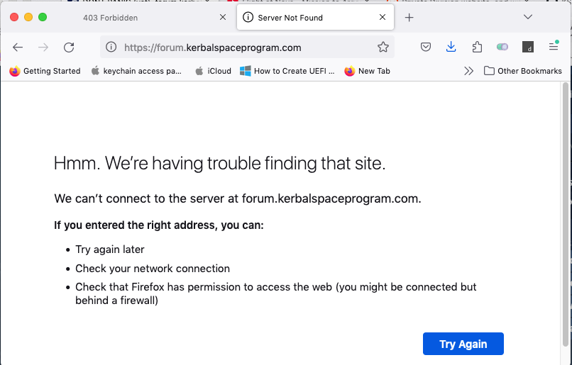
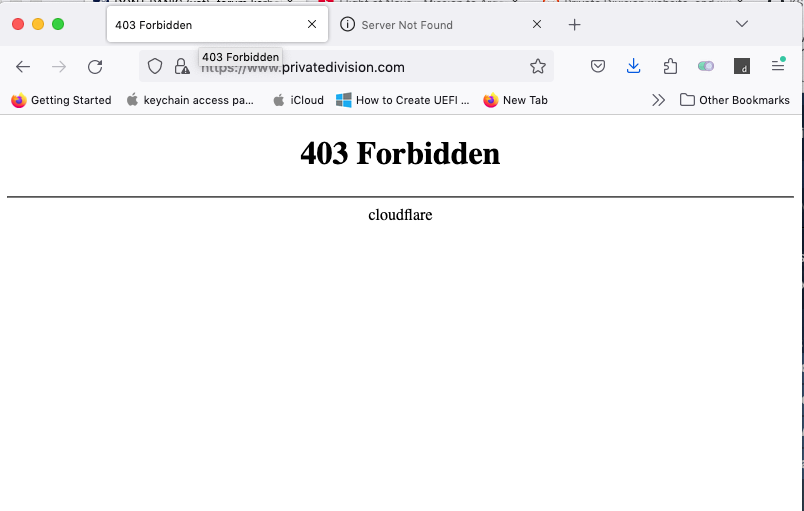

# KSP's Forum Preservation Project :: News :: 2025-0122T0405z

## Forum is down. **AGAIN**

I'm biting the bullet and giving you the news as fast as I could to avoid panic: as from 04:05 Zulu [forum.kerbalspaceprogram.com](https://forum.kerbalspaceprogram.com) is currently offline - as well [Private Division](https://www.privatedivision.com/), by the way.

None of them are back online at the moment of this writing.

My investigations pinpoints Cloudflare as the cause of the failure, so it's not the Krakens raining fire and suffering on us. Yet.

This is the current DNS entry for forum:

```
forum.kerbalspaceprogram.com	CNAME	2879		forum.kerbalspaceprogram.com.cdn.cloudflare.net
```

When trying to access `cdn.cloudflare.net` I get the very same error page I get when trying to get `forum.kerbalspaceprogram.com.cdn.cloudflare.net`, that it's exact the same error page when I try `forum.kerbalspaceprogram.com`:



Private division, however, is giving me a different error:



[Some dude on Reddit commented](https://www.reddit.com/r/KerbalSpaceProgram/comments/1i72tlm/comment/m8hh51z/) that other game's wiki under Cloudflare also borked yesterday, and I had problems with Steam and Bitbucket today.

I think these events may be related.
