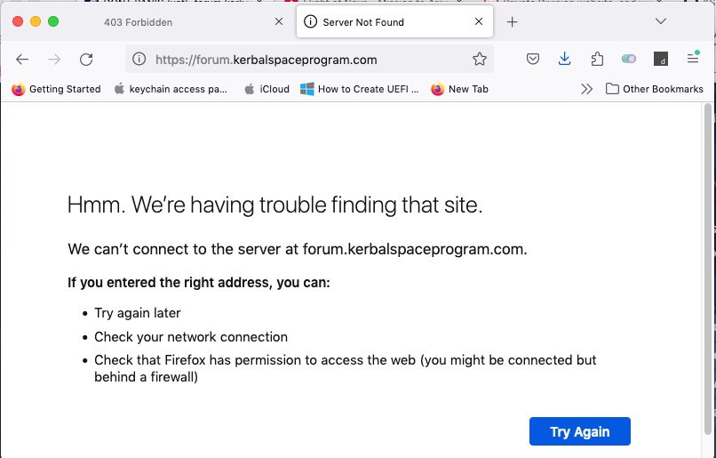
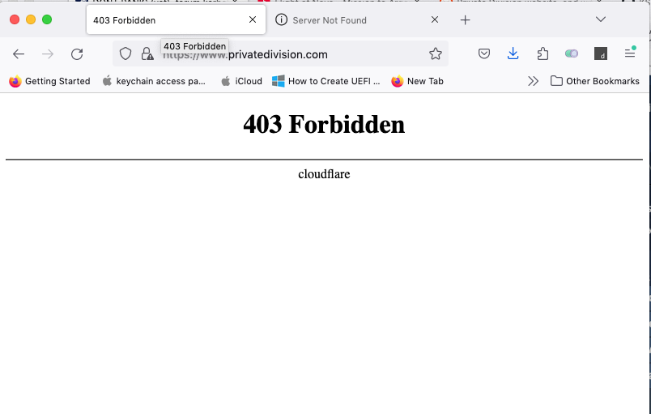

# KSP's Forum Preservation Project :: News :: 2025-0122T0405z

## Forum is down. **AGAIN**

I'm biting the bullet and giving you the news as fast as I could to avoid panic: as from 04:05 Zulu [forum.kerbalspaceprogram.com](https://forum.kerbalspaceprogram.com) is currently offline - as well [Private Division](https://www.privatedivision.com/), by the way.

None of them are back online at the moment of this writing.

When trying to access `forum.kerbalspaceprogram.com.cdn.cloudflare.net` I get the exact the same error page when I try `forum.kerbalspaceprogram.com`:

Private division, however, is giving me a different error:

[Some dude on Reddit commented](https://www.reddit.com/r/KerbalSpaceProgram/comments/1i72tlm/comment/m8hh51z/) that other game's wiki under Cloudflare also borked yesterday, and I had problems with Steam and Bitbucket today.

But apparently these events are unrelated.

### Addendum

Unsurprisingly, [wiki](https://wiki.kerbalspaceprogram.com) is also down. Same behaviour as Forum.
