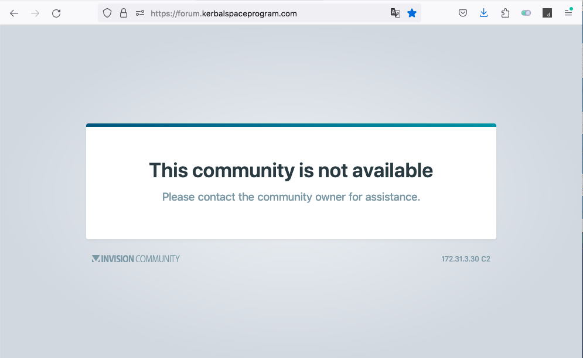

# Forum temporarily unavailable

On March 19th, 2026, approximately from 13:30 to 17:00 Zulu time, Forum was unavailable with a scaring message from Invision:

Googling around, I learnt that this message is used both when a Forum doesn't exists anymore but also when it's temporarily down for some hard core maintenance, so not really a serious event.

But it would not hurt being warned in advance, as well having a less scaring message about the event... As we say around here where I live:

> *Gato escaldado tem medo de água fria e cachorro que foi mordido por uma cobra pega medo de lingüiça...*
